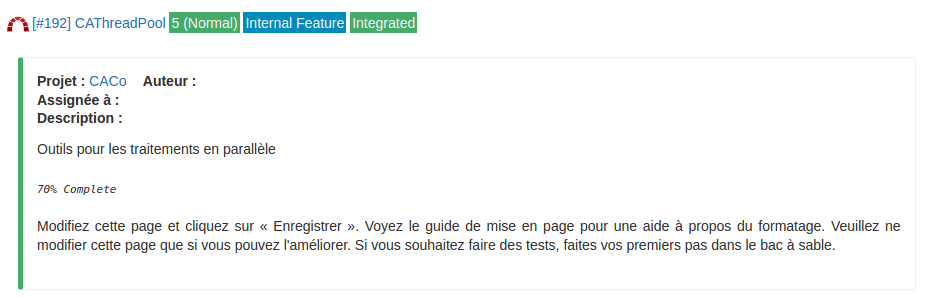
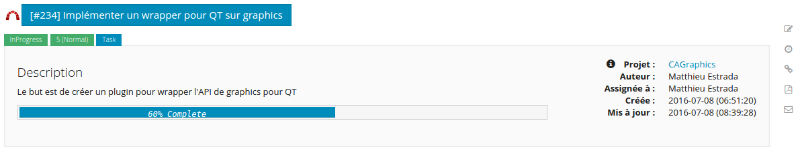

# Plugin Redissue

Plugin Dokuwiki display issues of Redmine and keep the rights of Redmine too. Redissue have the following features:

* Name of issue
* Number, percentage, author of issue
* Make a link to the choosen issue in Redmine and the related project.
* Display more or less information depending on your rights.
* Compatible with [Bootstrap](http://getbootstrap.com/) (like with [Dokuwiki Temaplte Bootstrap3](https://github.com/LotarProject/dokuwiki-template-bootstrap3/)).

## Requirements

Redissue needs [Php-Redmine-API](https://github.com/kbsali/php-redmine-api) to work. Download it inside the ROOT of your redissue's folder or inside ``/usr/share/php`` folder. The last place is better if you use [Redproject](https://www.dokuwiki.org/plugin:redissue) too, as you've just to install API once time.

In any case, Php-Redmine-API must be located inside a `vendor` folder !

```bash
mkdir vendor
cd vendor
git clone https://github.com/kbsali/php-redmine-api.git
cd php-redmine-api
# Go to last version. Use "git describe --abbrev=0" to see last tag.
git checkout v1.5.x
```

Don't forget to install the **requirements** of PhP-Redmine-API :

```bash
sudo apt-get install php5-curl php5-common
```

## Install

Download Redissue plugin into your ``${dokuwiki_root}/lib/plugins`` folder and restart dokuwiki.

## Configuration

You can configure Redissue in the Config Manager of DokuWiki:

* redissue.url: Put your Redmine's url server, without a slash ending. Example : ``http://myredmine.com``. This setting can be override by _server_ option.
* redissue.img: Maybe you have a custom icon for your Redmine installation. You can put image'url here. Example : ``http://www.example.com/image.png``
* redissue.theme: If you have the theme [Bootstrap 3](https://www.dokuwiki.org/template:bootstrap3) installed (or another supported _Bootstrap_ theme), you can set redissue to bootstrap. Otherwise, simply choose theme Dokuwiki.
* redissue.API: Set your Redmine API's key, preference Administrator key. This setting can be override by _server_ option.
* redissue.view: Choose the view you want to display. This will depend on the wiki user's access rights in Redmine.
  * Impersonate: select this if your wiki's users have the same UID as Redmine's users. e.g. : LDAP authentication. Redissue then will manage rights based on private or public projects.
  * Userview: doesn't manage access rights and display issue even if it's in private project.

Some advanced settings are also available below.

## Syntax

### Single issue syntax:

```php
<redissue id="#number_issue" text="text_if_no_rights_or_API" />
```

* id: id of the wanted issue.
* text: displays a text other than the default if the user does not have the rights or the issue does not exist

### Multiple issue syntax

If you want to get all issues of a specific project and/or a specific tracker, it's also possible. You've **2** other options:

* project: the **right** identifier of the project (Available in the settings of redmine project): project="myproject"
* tracker: the identifier number of your tracker. (You can found this number if you look at the number in the link of a tracker): tracker="3"

In this case, the twice parameter **must be set** but one can be empty. E.g: if you want to have all issues of a project for all trackers, you can leave tracker empty

* limit: set the limit of issues displayed. Default is 25.

**Examples:**

```php
// Display the first 25 issues with tracker 1 for project "myproject"
<redissue project="myproject" tracker="1" />
// Display the first 25 issues for project "myproject"
<redissue project="myproject" tracker="" />
// Display the first 50 issues with tracker 4 for all projects (if you have rights)
<redissue project="" tracker="4" limit="50" />
```

You can also sort the issues according to your interests.

* sort: choose how issues will be displayed. by default they are displayed by **id** number, from the most recent to the oldest (descending).

You can choose to sort by : id, subject, project, tracker, ...

**Examples:**

```php
// Sort issue by ascending "id", for project "myproject" and tracker "1"
<redissue project="myproject" tracker="1" sort="id" />
// Sort issue by "subject" for project "myproject" and all trackers
<redissue project="myproject" tracker="" sort="subject"/>
```

### Manage Multiple Servers

* server: In case you have multiple server, you can override the server url and the API key defined in the Redissue **settings**. You must define these in a json file called `server.json` (already available in plugin folder). This file must be at root of redissue folder.

Example of _server.json_ file:

```json
{
    "first": {
        "url": "http://myfirst.redmine.com",
        "api_token": "abcdefghijklmnopqrstuvwxyz0123456789"
    },
    "second": {
        "url": "http://mysecond.redmine.com",
        "api_token": "zyxwvutsrqponmlkjihgfedcba9876543210"
    }
}
```

Then simply add your server with: `server="first"` in redissue syntax.

**Note:** If server url or key in json file is wrong or if you put a wrong name in "server" parameter(e.g: call _flirt_ instead _first_), redissue take the one who is set in dokuwiki settings. If **url** or **api_token** are wrong everywhere, an error message will be displayed instead of redissue.

### Other options

* title: you can override issue title if it's too long or for other reasons with: `title="my new title"`.
* short: (**dokuwiki theme only**, bootstrap not needed this functionnality). If you've dokuwiki theme, you can hide additional information with short: `short="1"`.

Then, Redissue will display all the issue of this tracker for this specific project. If "project" or "tracker" identifiers are bad, Redissue display only issue with Id you have defined in "id" option.

## Preview

Here is a preview of redissue:

* Dokuwiki theme



* With a bootstrap Theme



For further information, see also [Redissue on dokuwiki.org](https://www.dokuwiki.org/plugin:redissue)
