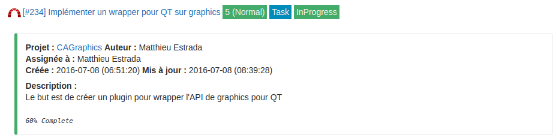

# Plugin Redissue

Plugin Dokuwiki display issues of Redmine and keep the rights of Redmine too. Redissue have the following features:

* Name of issue
* Number, percentage, author of issue
* Make a link to the choosen issue in Redmine and the related project.
* Display more or less information depending on your rights.
* Compatible with [Bootstrap](http://getbootstrap.com/) (need [Bootstrap3 Template](https://github.com/LotarProject/dokuwiki-template-bootstrap3/).

## Requirements

Redissue needs [Php-Redmine-API](https://github.com/kbsali/php-redmine-api) to work. Download it inside the ROOT of your redissue's folder or inside ``/usr/share/php`` folder. The second way is better if you use [Redproject](https://www.dokuwiki.org/plugin:redissue) too, as you've just to install API once time.

```bash
$ mkdir vendor
$ cd vendor
$ git clone https://github.com/kbsali/php-redmine-api.git
$ cd php-redmine-api
$ git checkout v1.5.5
```

Don't forget to install the requirements of PhP-Redmine-API :

```bash
$ sudo apt-get install php5-curl php5-common
```

## Install

Download this plugin into your ``${dokuwiki_root}/lib/plugins`` folder and restart dokuwiki.

## Configuration

You can configure the plugin in the Config Manager of DokuWiki:

* redissue.url: Put your Redmine's url server, without a slash ending. Example : ``http://myredmine.com``. This setting can be override by _server_ option.
* redissue.img: Maybe you have a custom icon for your Redmine installation. You can put image'url here. Example : ``http://www.example.com/image.png``
* redissue.theme: If you have the theme [Bootstrap 3](https://www.dokuwiki.org/template:bootstrap3) installed (or another supported _Bootstrap_ theme), you can set redissue to bootstrap. Otherwise, simply choose theme Dokuwiki.
* redissue.API: Set your Redmine API's key, preference Administrator key. This setting can be override by _server_ option.
* redissue.view: Choose the view you want to display. This will depend on the wiki user's access rights in Redmine.
  * Impersonate: select this if your wiki's users have the same UID as Redmine's users. e.g. : LDAP authentication. Redissue then will manage rights based on private or public projects.
  * Userview: doesn't manage access rights and display issue even if it's in private project.

## Syntax

### Common options

There is two way to use this plugin:

* First Syntax:

``<redissue id='#number_issue' text="text_if_no_rights_or_API" /> ``

* Second Syntax:

Only needed if you want to add some additional information. Description of issue is already displayed by Redissue.

``<redissue id='#number_issue' text="text_if_no_rights_or_API" >Additional notes...</redissue>``

### Other options:

* server: override the server url and the API key. You must define these in `server.json` file at root of redissue folder.

Example of _server.json_ file:

```json
{
    "first": {
        "url": "http://myfirst.redmine.com",
        "api_token": "abcdefghijklmnopqrstuvwxyz0123456789"
    },
    "second": {
        "url": "http://mysecond.redmine.com",
        "api_token": "zyxwvutsrqponmlkjihgfedcba9876543210"
    }
}
```

Then simply add your server with: `server="first".

**Note:** If server key is bad (e.g: call _flirt_ instead _first_), redissue take the one who is set in dokuwiki settings. If url or api_token are wrong, an error message is display instead of redissue.

* title: you can override title if it's too long or other reason: `title="my title"`.
* short: (**dokuwiki theme only**, bootstrap not needed this functionnality). If you've dokuwiki theme, you can hide additional information with short: `short="1"`.

## Preview

Here is a preview of redissue:

* Dokuwiki theme



* With a bootstrap Theme


For further information, see also [Redissue on dokuwiki.org](https://www.dokuwiki.org/plugin:redissue)
